# 小程序工作原理

和 taro 与 kbone 的结构基本一致

* 和 taro/kbone 不同：HNode 和 vue3 的 renderer api 绑定，而不是伪装成 BOM/DOM
* 和 taro 不同：不以跨平台为目标，不屏蔽组件和平台api的差异
* 页面分解成多个 Fragment 组件渲染，从而方便局部重渲染。以 GenericPage id 和 Fragment id 定位到需要更新的局部区域
* Fragment 会渲染多个 HNode，避免 Fragment 数量过多
* Fragment 从属性上获得所有数据，自身不触发 setData，从而提高首屏速度
* 每个 HNode 都知道自己对应的 Fragment。所以 HNode 树实际上是两棵树（一颗源自 VNode，一颗源自 Fragment）合并成一棵树来表示，所以叫 Hybrid

renderPages 流程

1. 从 vite server 加载对应的 html 和 js 代码，创建 vue app
2. 从 html 恢复服务端状态，业务 tsx 代码的 render 函数产生 VNode
3. vue 调用 renderer api 生成 HNode
4. 在 HNode 树上分拆 Fragment，标记 Fragment id
5. 挑选出需要重渲染的 Fragment，如果是首次渲染，则直接重渲染根节点 Fragment
6. 回调小程序，提供 GenericPage id, Fragment id 以及这个 Fragment 下 JSON 序列化之后的 HNode
7. Fragment 的 wxml 解释渲染 JSON 序列化之后的 HNode，完成一次渲染

HMR 流程

1. 从 vite server 的 websocket 获悉文件更新
2. 序列化当前页面状态为 html，清空代码和vue app的缓存
3. 加载新代码，用 html 恢复状态，重渲染 vue app

handleEvent 流程

1. 小程序eh接到事件
2. 回调 quick.js 沙盒，提供 GenericPage id，以及事件对应的 HNode id，以及事件本身
3. 找到对应的 HNode，触发 vue 注册的 event listeners
4. vue 触发业务 tsx 代码
5. 如果事件处理过程中触发了 vue 重渲染，标记页面为 dirty，在 vue.nextTick 重走上面的渲染流程

沙盒侧的接口

* renderPages：打开了新的小程序页面时触发，提供当前页面栈中的所有页面以及其参数
* handleEvent：当用户点击了按钮或者触发了其他事件时调用
* 回调 vf.setData：按 id 更新 GenericPage / Fragment
* 回调 wx：所有微信小程序的 wx 对象上的接口都可以直接在 vue 的 tsx 代码中调用，部分接口需要做 promisify 的转换